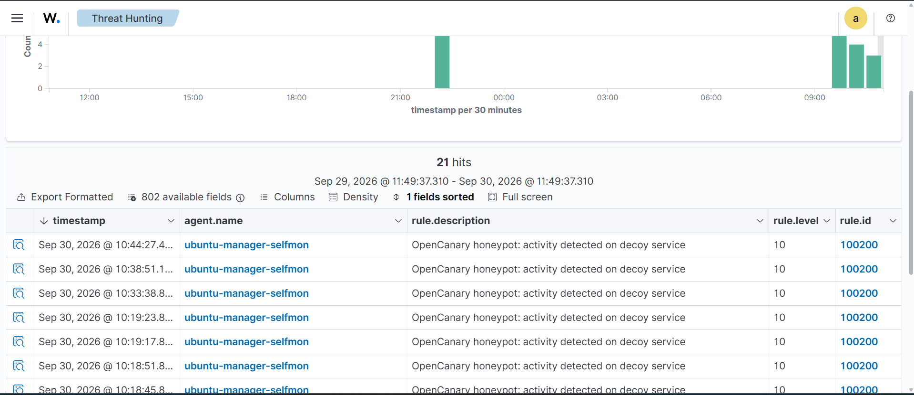


### Actions realisees

1. **Boot VM Kali** dans VMware, network adapter configure sur le VMnet isole (meme reseau que Ubuntu/Windows).
2. **IP verifiee** : `192.168.199.130/24` sur eth0 (DHCP).
3. **Connectivite validee** :
4. **Outils verifies** (nmap, hydra, sqlmap, wfuzz, gobuster : deja presents dans Kali standard).
5. **Installation crackmapexec** :
```bash
   sudo apt update && sudo apt install -y crackmapexec
```
   Note : crackmapexec 5.4.0-0kali7. Successeur `nxc` (NetExec) recommande a terme.

### Difficultes rencontrees

- **Honeypot OpenCanary non-persistant** : le test `nc 192.168.199.129 21` a repondu `Connection refused` — le daemon ne demarre pas automatiquement au boot de la VM Ubuntu. A corriger en creant un service systemd, ou a relancer manuellement avant chaque session (`sudo opencanaryd --start`). Sera adresse au demarrage de l'Attack #2.

### Etat final

Kali (192.168.199.130) pret pour lancer les 5 scenarios d'attaque des issues #21 a #25.

---

## Task 2 — Attack #1 : Network reconnaissance with Nmap (issue #21)

### Objectif
Depuis Kali (192.168.199.130), effectuer une reconnaissance reseau sur les 3 cibles du lab et verifier que le honeypot OpenCanary detecte le scan.

### MITRE ATT&CK
- **T1046** — Network Service Discovery
- Tactique : Discovery

### Scans effectues

**Scan 1 — Host discovery**
Resultat : hosts up (Kali, Ubuntu/Wazuh, Windows AD, gateway).

**Scan 2 — Ports Ubuntu (mix services legit + honeypot)**
Resultat : les 7 ports honeypot detectes "open" (ftp, telnet, ssh-alt, mysql, upnp, redis, sun-answerbook).

**Scan 3 — Ports Windows AD**
Resultat : services AD standards detectes (DNS, Kerberos, SMB, LDAP, RDP, WinRM).

### Detection Wazuh

Le scan 2 (`nmap -sT` sur les ports honeypot) a genere plusieurs alertes **rule.id 100200** (level 10) dans le dashboard, une par service leurre touche. Au total, apres 3 iterations de scan, 21 alertes 100200 visibles dans la timeline sur 24h.

- **-sS (SYN scan)** : n'etablit pas de handshake TCP complete ? les services applicatifs ne loggent PAS la connexion. Nmap voit les ports "open" mais **le honeypot ne detecte rien**. C'est justement pourquoi les attaquants reels preferent SYN scan (furtif).
- **-sT (TCP connect scan)** : etablit une handshake complete ? chaque service honeypot logue la connexion ? alertes Wazuh generees.

**Lecon defensive** : Un honeypot bien configure doit etre couple a une detection IDS/IPS niveau paquets (Suricata, Zeek) pour capter aussi les SYN scans furtifs. Le honeypot seul ne suffit pas contre un attaquant discret.

### Difficultes rencontrees

Tentative de creer une regle d'agregation `rule.id 100210` (level 15) qui declenche sur "3+ evenements 100200 en 60s". Le decodeur JSON de Wazuh n'expose pas automatiquement `srcip` a partir du champ `data.src_host` d'OpenCanary, ce qui empeche l'utilisation directe de `<same_source_ip/>`. A traiter dans une iteration future via un decodeur JSON custom ou un `<same_field>` sur le bon path.

### Preuve


### Valeur pedagogique
Ce scenario demontre :
1. Le honeypot fait exactement son travail : reveler tout attaquant qui tate les portes fermees legitimes
2. La distinction technique **SYN scan vs TCP connect** : le premier passe sous les radars applicatifs
3. La complementarite honeypot ? IDS reseau pour une couverture complete


