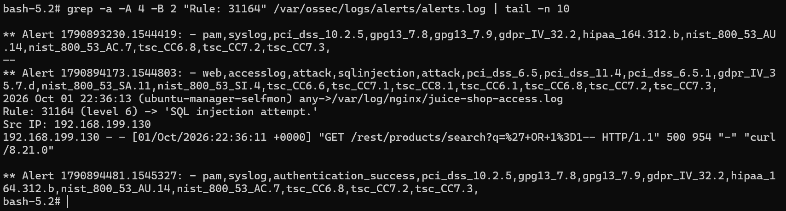
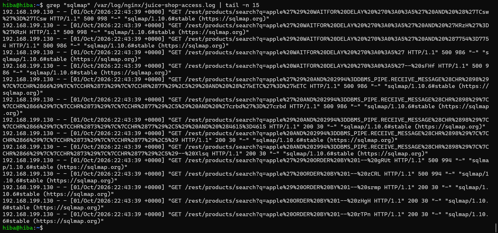
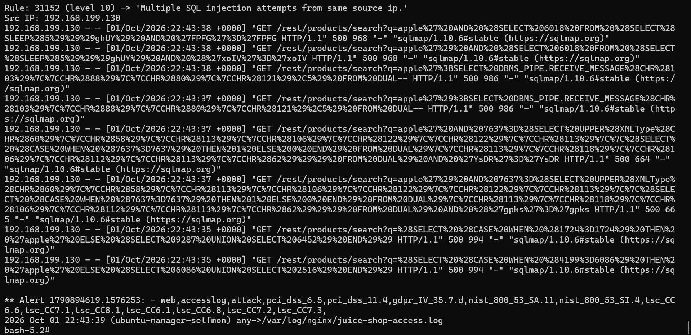
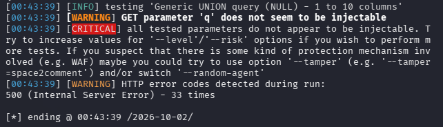

# Jour 4 — Attack #3 : Automated SQL Injection Detection

## Task 1 — Attack #3 : Automated SQL injection with sqlmap (issue #23)

### Objectif

Depuis Kali (`192.168.199.130`), executer des tentatives automatisees d injection SQL contre OWASP Juice Shop, verifier la collecte des requetes HTTP via Nginx, puis analyser leur detection et leur correlation par Wazuh.

L objectif principal est defensif : valider toute la chaine de supervision depuis la source de l attaque jusqu a l alerte SIEM.

### Architecture utilisee

Kali Linux `192.168.199.130`
→ requetes HTTP / sqlmap
→ Nginx Reverse Proxy sur Ubuntu `192.168.199.129:8080`
→ proxy_pass vers OWASP Juice Shop `localhost:3000`
→ logs dans `/var/log/nginx/juice-shop-access.log`
→ Wazuh Agent
→ Wazuh Manager
→ Detection / Correlation

Le trafic passe volontairement par le port `8080` afin que Nginx puisse journaliser les requetes avant de les transmettre a Juice Shop sur le port `3000`.

### Configuration de la collecte Nginx

Le Wazuh Agent Ubuntu a ete configure pour surveiller :

`/var/log/nginx/juice-shop-access.log`

Configuration ajoutee dans `ossec.conf` :

<localfile>
  <log_format>apache</log_format>
  <location>/var/log/nginx/juice-shop-access.log</location>
</localfile>

La collecte a ete validee avec :

`wazuh-logcollector: INFO: (1950): Analyzing file: '/var/log/nginx/juice-shop-access.log'.`

### Baseline HTTP normale

Requete normale envoyee depuis Kali :

`curl "http://192.168.199.129:8080/rest/products/search?q=apple"`

Exemple observe :

`GET /rest/products/search?q=apple HTTP/1.1" 200`

Wazuh decode correctement l evenement avec :

- name: `web-accesslog`
- id: `200`
- protocol: `GET`
- srcip: `192.168.199.130`
- url: `/rest/products/search?q=apple`

Cette requete normale correspond a la regle `31100` de niveau `0`.

### Test SQL injection manuel

Payload utilise :

`' OR 1=1--`

Version URL-encodee observee par Nginx :

`/rest/products/search?q=%27+OR+1%3D1--`

Wazuh decode :

- name: `web-accesslog`
- id: `500`
- protocol: `GET`
- srcip: `192.168.199.130`
- url: `/rest/products/search?q=%27+OR+1%3D1--`

Detection :

`Rule: 31164 (level 6) -> 'SQL injection attempt.'`

La regle native `31164` dans `0245-web_rules.xml` detecte plusieurs patterns SQL suspects dans le champ `url`.

### Preuve — SQL injection manuelle

### Execution automatisee avec sqlmap

Commande utilisee depuis Kali :

`sqlmap -u "http://192.168.199.129:8080/rest/products/search?q=apple" -p q --batch --level=1 --risk=1`

Le parametre `q` est teste directement avec `-p q`.

Les options `--level=1` et `--risk=1` permettent de commencer par les tests de base.

Les logs montrent plusieurs familles de payloads, notamment :

- SELECT
- UNION
- EXTRACTVALUE
- PG_SLEEP
- WAITFOR DELAY
- DBMS_PIPE
- ORDER BY
- CAST
- CASE WHEN

Le User-Agent observe est :

`sqlmap/1.10.6#stable (https://sqlmap.org)`

### Preuve — requetes sqlmap dans Nginx

### Detection Wazuh

Plusieurs regles natives ont ete declenchees :

| rule.id | level | Description |
|---|---:|---|
| 31122 | 5 | Web server 500 error code |
| 31103 | 7 | SQL injection attempt |
| 31171 | 6 | SQL injection attempt |
| 31106 | 6 | A web attack returned code 200 |
| 31152 | 10 | Multiple SQL injection attempts from same source ip |
| 31162 | 10 | Multiple web server 500 error code |

Les regles `31103` et `31171` detectent plusieurs variantes de SQL injection.

La regle `31122` signale les erreurs HTTP `500`.

La regle `31106` indique qu une requete reconnue comme attaque web a recu une reponse HTTP `200`.

Un code HTTP `200` ne prouve pas a lui seul qu une exploitation a reussi.

### Correlation Wazuh

La detection la plus significative est :

`Rule: 31152 (level 10) -> 'Multiple SQL injection attempts from same source ip.'`

Source :

`192.168.199.130`

La regle native utilise :

- `frequency="8"`
- `timeframe="120"`
- `if_matched_sid = 31103`
- `same_source_ip`

Cela signifie que plusieurs detections SQLi associees a la regle `31103`, provenant de la meme IP dans une fenetre de 120 secondes, declenchent une alerte de niveau 10.

### Preuve — correlation Wazuh

### Resultat final sqlmap

Resultat :

`[WARNING] GET parameter 'q' does not seem to be injectable`

`[CRITICAL] all tested parameters do not appear to be injectable.`

`500 (Internal Server Error) - 33 times`

Avec `--level=1` et `--risk=1`, sqlmap n a donc pas confirme que le parametre `q` etait exploitable.

### Preuve — resultat sqlmap

### Interpretation SOC

Une distinction importante est :

`tentative d attaque detectee != exploitation confirmee`

Wazuh a correctement detecte et correle des comportements suspects, meme si sqlmap n a pas confirme l exploitation.

Une alerte SIEM est donc un signal d investigation, pas automatiquement une preuve de compromission.

### Detection native vs regle custom

Aucune regle custom supplementaire n a ete necessaire pour cette detection principale.

Wazuh couvre deja efficacement le scenario avec notamment :

- `31103`
- `31164`
- `31171`
- `31152`

Une future amelioration pourrait consister a detecter specifiquement les scanners SQL automatises en combinant plusieurs indicateurs comme la frequence, la meme IP source, le User-Agent et les erreurs serveur.

### MITRE ATT&CK

Mapping principal retenu :

- **T1190 — Exploit Public-Facing Application**
- Tactique : **Initial Access**

Certaines regles natives Wazuh contiennent aussi un mapping vers `T1055`, mais `T1190` est plus pertinent pour cette simulation web.

### Valeur pedagogique

1. Telemetry avant detection : sans logs HTTP detailles, le SIEM ne peut pas analyser correctement les requetes web.
2. Nginx fournit une source de telemetrie HTTP exploitable.
3. Le decoder `web-accesslog` extrait les champs utiles.
4. Les regles Wazuh effectuent ensuite la detection.
5. La correlation permet d identifier une activite automatisee.
6. Une detection n implique pas automatiquement une exploitation reussie.
7. Les regles natives doivent etre evaluees avant de creer inutilement une regle custom.

### Etat final

Attack #3 validee :

- Nginx utilise comme reverse proxy
- logs HTTP collectes
- Wazuh Agent configure
- decoder `web-accesslog` valide
- baseline normale testee
- SQLi manuelle detectee
- trafic sqlmap capture
- plusieurs signatures SQLi detectees
- correlation `31152` niveau 10 declenchee
- correlation des erreurs HTTP 500 observee
- source `192.168.199.130` identifiee
- MITRE ATT&CK T1190 documente
- exploitation non confirmee avec `--level=1 --risk=1`

### Conclusion

La chaine complete de supervision est validee :

Kali / sqlmap
→ Nginx
→ Access logs
→ Wazuh Agent
→ Wazuh Manager
→ Detection
→ Correlation
→ SOC Alert

Wazuh a detecte et correle avec succes l activite associee aux tentatives automatisees de SQL injection.

L objectif defensif de l issue #23 est atteint.

**Issue : #23**

**Status : Completed**
